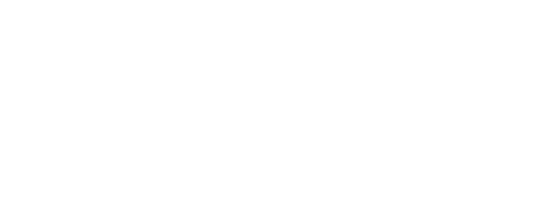

    

## About
Front and back end source code for [infinitecraft.init.cx](https://infinitecraft.init.cx), a tree view recipe explorer for the game ["Infinite Craft"](https://neal.fun/infinite-craft/).

    

#### Stack
Written in Golang and Typescript with a simple SqLite DB.

#### Future Features
- More recipes
- Better optimal recipe algorithm

